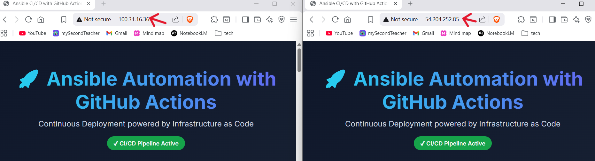

# 🚀 Automated Nginx Deployment with Ansible & GitHub Actions

This project demonstrates how to automate Nginx installation and configuration on AWS EC2 instances using:

- Ansible for configuration management  
- GitHub Actions for CI/CD automation  
- AWS EC2 instances as target servers  

The infrastructure is managed using Infrastructure as Code (IaC) principles.

---

# 📘 What is Ansible?

Ansible is an open-source automation tool used for:

- Configuration management  
- Application deployment  
- Infrastructure provisioning  
- Orchestration  

It connects to remote servers via SSH and executes tasks using small Python modules.

---

# 📜 What is a Playbook?

A playbook is a YAML file that defines:

- Which servers to target  
- What tasks to execute  
- The desired state of the system  

Example:

```yaml
- name: Example Play
  hosts: server_nodes
  become: true

  tasks:
    - name: Install nginx
      package:
        name: nginx
        state: present
```
Playbooks are declarative - you define the desired outcome rather than step-by-step shell commands.

---

# 📂 What is an Inventory File?

An inventory file defines the servers Ansible will manage.  
It can be written in INI or YAML format. 

```yaml
all:
  children:
    server_nodes:
      hosts:
        server-1:
          ansible_host: 3.85.xxx.xxx
          ansible_user: ubuntu
        server-2:
          ansible_host: 52.203.xxx.xxx
          ansible_user: ubuntu
```
Explanation:

- `all`        : Root group containing all hosts
- `children`    : Sub-groups
- `server_nodes`: Custom group
- `hosts `      : EC2 instances
- `ansible_host`: Public IP
- `ansible_user`: SSH username

---

# 🧩 Project Structure

```bash
ansible-gha/
│
├── inventory.yml
├── install_nginx_default.yml
├── install_nginx_custom.yml
├── index.html
└── .github/workflows/deploy.yml
```
---

# ✅ Prerequisites
Before running this project, ensure to have:
- An active AWS account
- Two Ubuntu EC2 instances with:
    - Port 22 (SSH) open
    - Port 80 (HTTP) open
- AWS SSH key pair (.pem file)
- A GitHub repository with GitHub Actions enabled
- SSH private key stored as a GitHub Secret (SSH_PRIVATE_KEY)

---

# 🟢 Part 1 – Default Nginx Installation

This deployment installs Nginx and starts the service without modifying the default web page.

## Workflow: `deploy-default.yaml`

```yaml
name: Deploy Default Nginx

on:
  workflow_dispatch:  

jobs:
  deploy:
    runs-on: ubuntu-latest

    steps:
      - name: Checkout Repository
        uses: actions/checkout@v4

      - name: Install Ansible
        run: |
          sudo apt update
          sudo apt install -y ansible

      - name: Create SSH Key File
        run: |
          echo "${{ secrets.EC2_SSH_KEY }}" > private_key.pem
          chmod 600 private_key.pem

      - name: Add ec2 host keys
        run: |
          mkdir -p ~/.ssh          
          for ip in $(grep ansible_host inventory.yaml | awk '{print $2}'); do 
            ssh-keyscan -H $ip >> ~/.ssh/known_hosts
        done
          
      - name: Run Ansible Playbook (Default Nginx)
        run: |
          ansible-playbook -i inventory.yaml install-nginx-default.yaml \
          --private-key private_key.pem

```
## Playbook: `install_nginx_default.yml`

```yaml
--- 
- name: Install and run Nginx on server nodes 
  hosts: server_nodes 
  become: true  

  tasks:  

    - name: Check connectivity  
      ping:  

    - name: Update apt cache 
      apt:  
        update_cache: yes  
      when: ansible_os_family == "Debian"  
  

    - name: Install nginx  
      package: 
        name: nginx 
        state: present  

    - name: Ensure nginx is running and enabled 
      service: 
        name: nginx  
        state: started  
        enabled: true  
```
### What it does?
- Installs Nginx
- Starts the service
- Enables auto-start on reboot

After successful deployment, visiting both servers public IP displays:


---

# 🔵 Part 2 – Custom Nginx Deployment

This deployment installs Nginx and replaces the default webpage with a custom HTML file.

## Workflow: `deploy-custom`

```yaml
name: Deploy Custom Nginx

on:
  workflow_dispatch:   # Manual trigger from GitHub UI

jobs:
  deploy:
    runs-on: ubuntu-latest

    steps:
      - name: Checkout Repository
        uses: actions/checkout@v4

      - name: Install Ansible
        run: |
          sudo apt update
          sudo apt install -y ansible

      - name: Create SSH Key File
        run: |
          echo "${{ secrets.EC2_SSH_KEY }}" | base64 -d > private_key.pem
          chmod 600 private_key.pem

      - name: Add ec2 host keys
        run: |
          mkdir -p ~/.ssh          
          for ip in $(grep ansible_host inventory.yaml | awk '{print $2}'); do
            ssh-keyscan -H $ip >> ~/.ssh/known_hosts
          done

      - name: Run Ansible Playbook (Custom Nginx)
        run: |
          ansible-playbook -i inventory.yaml install-nginx-custom.yaml \
          --private-key private_key.pem
```
### Playbook: install_nginx_custom.yml

```yaml
--- 

- name: Install and Configure Nginx on EC2 Nodes
  hosts: server_nodes
  become: true 

  tasks: 

    - name: Update apt cache
      apt:
        update_cache: yes 

    - name: Install nginx
      apt:
        name: nginx
        state: present 

    - name: Copy custom index.html
      copy: 
        src: index.html 
        dest: /var/www/html/index.html 
        owner: www-data 
        group: www-data
        mode: '0644'

    - name: Ensure nginx is running and enabled
      service:
        name: nginx
        state: started
        enabled: true
```

### What this does?
- Installs Nginx (if not already installed)
- Replaces the default page
- Keeps service running

After successful deployment,  visiting both servers public IP displays the custom page:



---

# ⚙️ CI/CD Automation

The deployment is triggered manually using GitHub Actions workflow.  
The workflow:
- Checks out the repository
- Installs Ansible
- Creates SSH key from GitHub Secret
- Runs the selected playbook

This enables fully automated remote configuration without manual SSH login.

---

# 📌 Conclusion

This project demonstrates how to automate Nginx deployment on AWS EC2 instances using Infrastructure as Code principles. 
 
By combining:
- Ansible for configuration management
- GitHub Actions for CI/CD automation
- AWS EC2 for infrastructure

The project shows both:
- Default Nginx installation
- Custom web page deployment

All without manually SSHing into servers.

---


